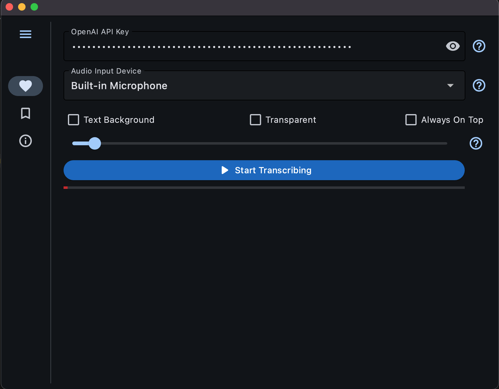

# Interview - Agent 

A interview agent build with Flet and OpenAI Whisper.




## Setting Up An Environment
On Windows:
```
cd transcriber_app
py -3.7 -m venv venv
venv\Scripts\activate
pip install -r requirements.txt
flet run main.py
```
On Unix:
```
git clone https://github.com/PiotrKrosniak/interview-agent.git
cd transcriber_app
python3.7 -m venv venv
source venv/bin/activate
pip install -r requirements.txt
flet run main.py
```


## Usage
* Upload Your CV and add Position you are applying too. 
* Select an input source using the dropdown.
* Click "Start Transcribing"

You need to specify the device to which Agent will listen to for example if you have interview overt MS Teams select it as audio source so ONLY the questions asked by the Panel will be answered. 

Application require Open AI API that you can get from their website here https://platform.openai.com/api-keys

**Application only answers questions and ignore all other not relevant discussions.**

You can also make the window transparent and set the text background, this is useful for overlaying on other apps. 


Read more about Whisper here: https://github.com/openai/whisper

Read more about Flet here: https://flet.dev/

The code in this repository is public domain.
